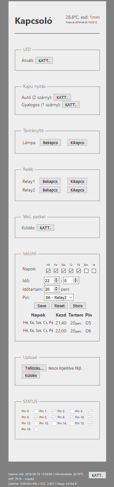

# Kapcsolo - ESP8266 webpage
A web page for controlling my device

## Screenshot


## Config file
Edit variables in file:
```sh
upload_config\variables.bat
```

## Edit
Open with your favourite editor
```sh
index.htm
```

## Upload
Start the batch file to upload gzipped index file to the device
```sh
upload.bat
```

Dependencies:
* 7zip
* curl (Windows10 ver.: 1803 has it)
